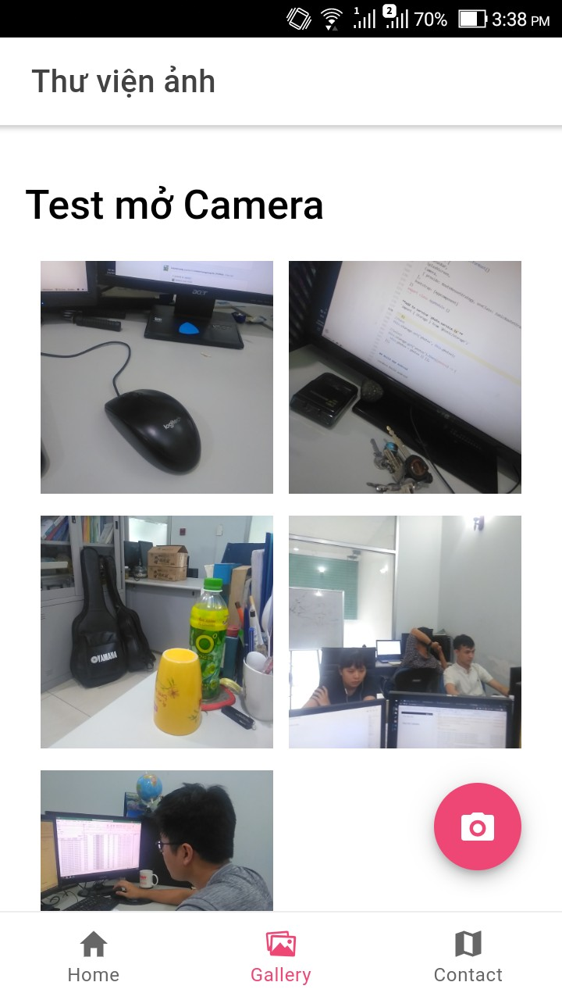

# ionic_angular_learning
ionic_angular_learning

Just what I learn when doing with angular and ionic, hope this repo can help someone^^

Let's start!

***

## photo-gallery

Test with local storage, access camera,...



## Install

`npm install -g ionic cordova`
```bash
C:\Users\soiqu\AppData\Roaming\npm\cordova -> C:\Users\soiqu\AppData\Roaming\npm\node_modules\cordova\bin\cordova
C:\Users\soiqu\AppData\Roaming\npm\ionic -> C:\Users\soiqu\AppData\Roaming\npm\node_modules\ionic\bin\ionic
+ cordova@9.0.0
+ ionic@5.4.1
```

## Creat app
`ionic start photo-gallery tabs`

Sử dụng template `tabs`

https://ionicframework.com/docs/v3/cli/starters.html

## Run app
`ionic serve`

## Add platform (Android/IOS)

https://ionicframework.com/docs/angular/your-first-app/ios-android-camera

Muốn sử dụng được các thành phần phần cứng của thiết bị thì phải add platform tương ứng vào.

### Android

```bash
ionic cordova platform add android
.........
[WARN] cordova-res was not found on your PATH. Please install it globally:

       npm i -g cordova-res

[WARN] Cannot generate resources without cordova-res installed.

       Once installed, you can generate resources with the following command:

       ionic cordova resources android --force
```

### IOS

```bash
ionic cordova platform add ios
......
> ionic cordova resources ios --force
> cordova-res.cmd ios
```

### Start Services (again)
`ionic serve --devapp`

Cài đặt App `Ionic DevApp` trên điện thoại

Truy cập để test các chức năng native của thiết bị như camera, gps, file,...

## Add the Camera Dependencies via the CLI

`npm install @ionic-native/camera`

**add the native iOS and Android code**

`ionic cordova plugin add cordova-plugin-camera`

The next step is only required for iOS users. As of iOS 10, developers must provide a reason for why the app wishes to access the device camera. Add this to the bottom of config.xml:

```xml
<!-- Required for iOS 10: Camera permission prompt -->
<edit-config file="*-Info.plist" mode="merge" target="NSCameraUsageDescription">
    <string>Used to take pictures</string>
</edit-config>
```

### Các nước add camera vô app

#### Add Camera plugin to Angular App Module `src/app/app.module.ts`

```ts
import { Camera } from '@ionic-native/camera/ngx';
providers: [
    StatusBar,
    SplashScreen,
    Camera,
    {provide: ErrorHandler, useClass: IonicErrorHandler}
  ],
```

#### Add the Camera to the Gallery page `tab2.page.html`

```html
<!--tab2.page.html-->


<ion-fab vertical="bottom" horizontal="center" slot="fixed">
  <ion-fab-button (click)="takePicture()">
    <ion-icon name="camera"></ion-icon>
  </ion-fab-button>
</ion-fab>
```
#### Add function take photo `tab2.page.ts`

```ts
import { Camera, CameraOptions } from '@ionic-native/camera/ngx';
export class Tab2Page {
  currentImage: any;
  constructor(private camera: Camera) {}

  takePicture() {
    const options: CameraOptions = {
      quality: 100,
      destinationType: this.camera.DestinationType.DATA_URL,
      encodingType: this.camera.EncodingType.JPEG,
      mediaType: this.camera.MediaType.PICTURE
    };

    this.camera.getPicture(options).then((imageData) => {
      this.currentImage = 'data:image/jpeg;base64,' + imageData;
    }, (err) => {
      // Handle error
      console.log("Camera issue:" + err);
    });
  }

}
```

## Save photo to device

### Make photo service
`ionic g service services/Photo`

Khi khai báo hàm trong services thì để gọi ra, chúng ta cần khai báo service đó, rồi gọi `[tên services].[tên hàm]`. Ví dụ:

**Khai báo services:**
```ts
export class Tab2Page {
  constructor(public photoService: PhotoService) {}  

}
```
**Gọi hàm trong services**

`<ion-col size="6" *ngFor="let photo of photoService.photos">`


### Use SQLite

#### Add sqlite storage

**Install**

`ionic cordova plugin add cordova-sqlite-storage`

**Add to js core**

`npm install --save @ionic/storage`

**Add lib to `app.module.ts`**

```ts
import { IonicStorageModule } from '@ionic/storage';

@NgModule({
  declarations: [AppComponent],
  entryComponents: [],
  imports: [
    BrowserModule,
    IonicModule.forRoot(),
    AppRoutingModule,
    IonicStorageModule.forRoot()
  ],
  providers: [
    StatusBar,
    SplashScreen,
    Camera,
    { provide: RouteReuseStrategy, useClass: IonicRouteStrategy }
  ],
  bootstrap: [AppComponent]
})
export class AppModule {}
```

**Add to service `photo.service.ts`**

`import { Storage } from '@ionic/storage';`

```ts
//Save
this.storage.set('photos', this.photos);

//Select
this.storage.get('photos').then((photos) => {
  this.photos = photos || [];
});
```

## Theme

**Color Generator**

https://ionicframework.com/docs/theming/color-generator

> You can find these colors defined in src/theme/variables.scss


**Automatically style base on platform**

>Ionic automatically provides platform specific styles based on the device the application is running on, giving that native look and feel your users are used to

```ts
imports: [
    BrowserModule,
    IonicModule.forRoot({
      mode: "md"
    }),
    IonicStorageModule.forRoot()
  ],
```

## Routing `app-routing.module.ts`

```ts
const routes: Routes = [
  {
    path: 'tabs',
    component: TabsPage,
    children: [
      {
        path: 'tab1',
        children: [
          {
            path: '',
            loadChildren: '../tab1/tab1.module#Tab1PageModule'
          }
        ]
      },
      {
        path: '',
        redirectTo: '/tabs/tab1',
        pathMatch: 'full'
      }
    ]
  },
  {
    path: '',
    redirectTo: '/tabs/tab1',
    pathMatch: 'full'
  }
];
```

## Build App

### Android

#### Build app

> Tạo bản release, muốn cài phải sign

`ionic cordova build android --prod --release`

> Tạo bản debug, có thể cài không cần sign

`ionic cordova build android --prod`

```bash
BUILD SUCCESSFUL in 58s
42 actionable tasks: 40 executed, 2 up-to-date
Built the following apk(s):
        D:\sync\websvr\xampp\ionic_angular_learning\photo-gallery\platforms\android\app\build\outputs\apk\release\app-release-unsigned.apk
```

>Ok, I have signed the app following `https://ionicframework.com/docs/building/running` and now I can install the release version.
So, if I use the command ionic cordova build android --prod I have a file “app-debug.apk” that I can eecute on my phone.
If I run the command ionic cordova build android --prod --release I have to sign the file “app-release-unsigned.apk” using this procedure `https://ionicframework.com/docs/building/running`

https://forum.ionicframework.com/t/how-to-solve-the-app-not-installed-error-on-android-devices/139401/7


#### Sign app

**Get key**

> Let’s generate our private key using the keytool command that comes with the JDK

https://ionicframework.com/docs/v1/guide/installation.html

`keytool -genkey -v -keystore my-release-key.keystore -alias alias_name -keyalg RSA -keysize 2048 -validity 10000`

**Sign app**

`jarsigner -verbose -sigalg SHA1withRSA -digestalg SHA1 -keystore my-release-key.keystore HelloWorld-release-unsigned.apk alias_name`

**Package to APK**

`zipalign -v 4 HelloWorld-release-unsigned.apk HelloWorld.apk`

>  The zipalign tool can be found in /path/to/Android/sdk/build-tools/VERSION/zipalign. For example, on OS X with Android Studio installed, zipalign is in ~/Library/Android/sdk/build-tools/VERSION/zipalign

### IOS

`cordova build ios`

**Cần máy IOS**

## Preferences

> My repo when I learning Angular
https://github.com/soiqualang/Learn_AngularJS

> Ionic Docs
* https://ionicframework.com/docs/intro
* https://ionicframework.com/docs/angular/your-first-app

> Icon Ionic
https://ionicframework.com/docs/v3/ionicons/

> Các kiểu button (icon)
https://ionicframework.com/docs/api/fab

> SQLite plugin
https://ionicframework.com/docs/building/storage

> Color Generator
https://ionicframework.com/docs/theming/color-generator

> Build
* https://ionicframework.com/docs/cli/commands/build
* https://ionicframework.com/docs/v3/cli/cordova/build/
* https://ionicframework.com/docs/v1/guide/publishing.html
* https://ionicframework.com/docs/v3/intro/deploying/
* https://forum.ionicframework.com/t/how-to-solve-the-app-not-installed-error-on-android-devices/139401/7

> IONIC API
* https://ionicframework.com/docs/api/
* https://ionicframework.com/docs/components

> VS Leaflet
* https://edupala.com/how-to-add-leaflet-map-in-ionic-4/
* https://tphangout.com/ionic-3-leaflet-maps-geolocation-markers/
* https://www.javascripttuts.com/using-leaflet-open-street-map-in-an-ionic-application-in-one-go/
* https://developer.here.com/blog/display-an-interactive-here-map-in-an-ionic-framework-application
* https://developer.here.com/blog/interacting-with-a-leaflet-map-in-an-ionic-framework-pwa